# Ex-07-CSS
 Name:PRAVEEN K

Reference Number: 23014148

Department: AI&DS

## Ex-07(i)-css
## AIM:
(i) Using CSS media queries, modify the webpage's color scheme with the following requirements:

#Default Color Scheme:

Background color: Light gray (#f4f4f4) Text color: Dark gray (#333) Link color: Blue (#007bff)

#Small Screen Adaptation (Max-width: 600px):

Change the background color to dark gray (#333) Change the text color to light gray (#f4f4f4) Change the link color to light green (#28a745)

#Dark Mode Preference:

If the user has set their device to dark mode, override the above styles with the following:

Background color: Black (#000) Text color: White (#fff) Link color: Cyan (#17a2b8)

#Deliverable:

Write the CSS code that implements the above requirements. Your code should include the base styles and the appropriate media queries for small screens and dark mode preference.

# DESIGN PROCEDURE:
## STEP 1:
Define the document type as HTML.

## STEP 2:
Open the HTML structure with the necessary head and body sections. In the head section, set the title of the webpage and define the styles for the webpage. The styles include: -->Default color scheme for the webpage. -->Adaptations for small screen sizes. -->Adaptations for users who prefer a dark color scheme.

## STEP 3:
In the body section, create a division with the text "Amazing places to visit". Also in the body section, create a list with links to the Discovery World, Christmas in Switzerand, Wonder la.

## STEP 4:
Close the HTML Structure.

# CODE:
```
<!Doctype html>
<html>
<head>
<style>
body {
 background-color: #f4f4f4;
 color: #333;
}
a{
color: #007bff;
}
@media screen and (max-width: 600px) 
{
	body{
          background-color: #333;
          color: #f4f4f4;

}
a{
color: #28a745;
}
}
@media(prefers-color-scheme:dark)
{
body
{
background-color: #000;
color: #fff;
}
a
{
color: #17a2b8;
}
}

</style>
</head>
    <h1>praveen web page welcomes you</h1>
    <ul>
        <li><a href=https://chat.openai.com>Chatgpt welcomes you</a></li>
        <li><a href=https://www.wikipedia.org>wikipedia</a></li>
        <li><a href=https://www.youtube.com>youtube</a></li>
    </ul>
</div>
</body>
</html>
```

# OUTPUT:
## (i)Default-screen
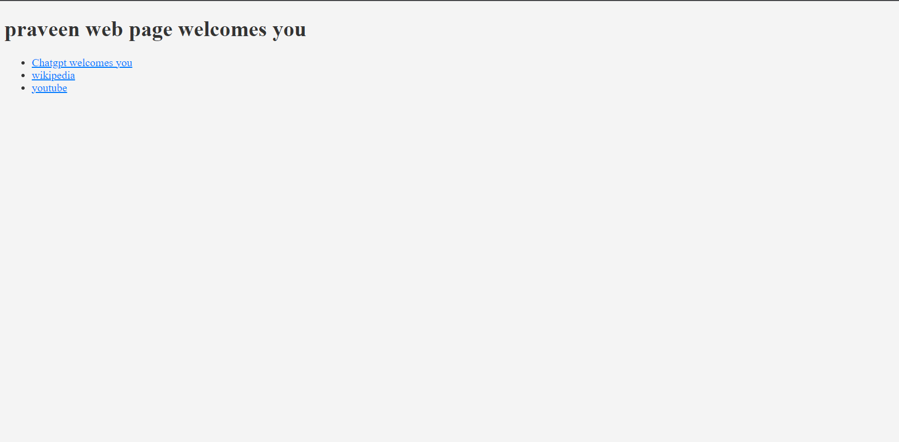
## (ii)Small-screen adaptation
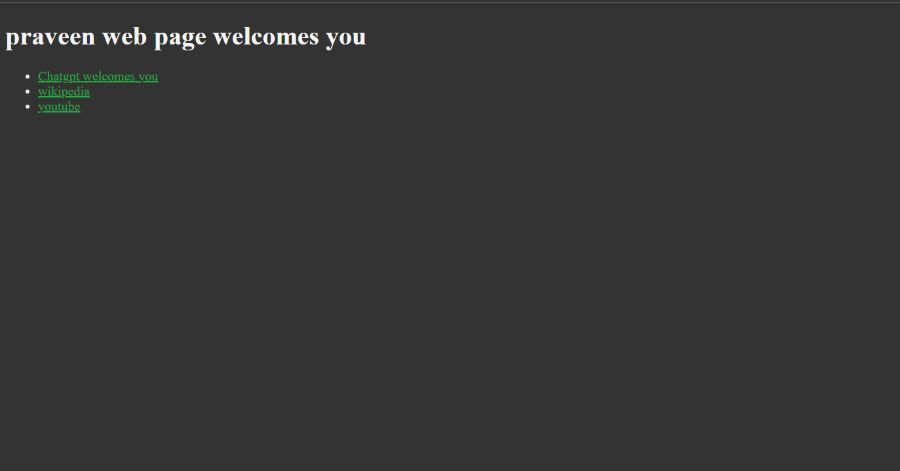
## (iii)dark-mode


# Ex-07(ii)-css
# AIM:
To use a media query in CSS to apply different styles to a webpage for mobile devices (with widths less than 600px) and desktop devices (with widths greater than or equal to 600px)? Provide an example CSS snippet to demonstrate your answer.

# DESIGN PROCEDURE:
## STEP 1:
Start the HTML document and create the root element.

## STEP 2:
Inside , create the element and include a style element for CSS rules.

## STEP 3:
Define CSS rules for desktop devices. Use a media query to define CSS rules for mobile devices.

## STEP 4:
Create the element inside , which will contain the webpage content.

## STEP 5:
Inside , create a for the heading and an for the list of hyperlinks.

## STEP 6:
End the HTML document by closing all open tags.

# CODE:
```
<!DOCTYPE html>
<html>
<head>
<style type="text/css">
    /* CSS rules for desktop devices */
    body {
        background-color: lightblue;
    }

    /* CSS rules for mobile devices */
    @media only screen and (max-width: 600px) {
        body {
            background-color: lightgreen;
        }
    }
</style>
</head>
<body>
    <div>
        <h1>praveen web page welcomes you</h1>
        <ul>
            <li><a href=https://chat.openai.com>Chatgpt welcomes you</a></li>
            <li><a href=https://www.wikipedia.org>wikipedia</a></li>
            <li><a href=https://www.youtube.com>youtube</a></li>
        </ul>
    </div>
 </body>
</html>
```
# OUTPUT:
## (i)Desktop view
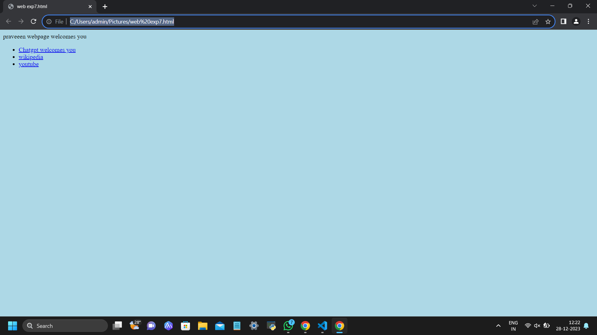
## (ii)Mobile view
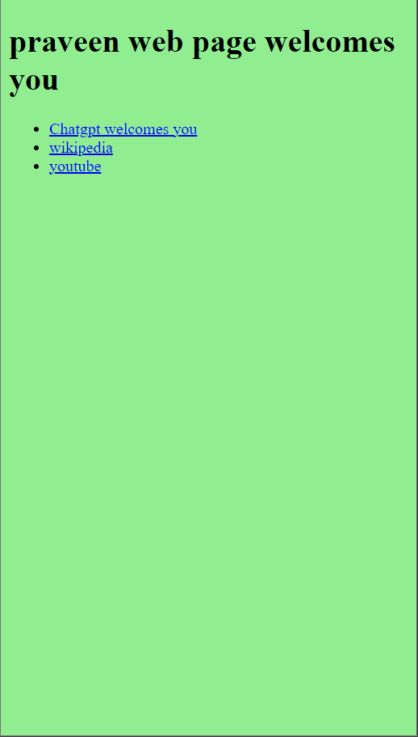

# Ex-07(iii)-css orientation-based media query
# AIM:
To explain how you can use CSS media queries to apply different styles based on the orientation (landscape or portrait) of the device.Provide a CSS example where you change the background color of the body based on the orientation.

# DESIGN PROCEDURE:
## STEP 1:
Identify the section in your HTML file where you want to add the CSS. This is typically within the style tags in the section.

## STEP 2:
Define a CSS media query for each orientation. The syntax for a media query is @media (orientation: value), where value can be either portrait or landscape.

## STEP 3:
Within each media query, specify the CSS rules you want to apply. In this case, you want to change the background color of the body.

## STEP 4:
Close the media query with a }.

## STEP 5:
Repeat steps 2-4 for the other orientation.

## STEP 6:
Save your HTML file. Open your HTML file in a web browser and change the orientation of your device to see the different styles applied.

# CODE:
```
<!DOCTYPE html>
<html>
  <head>
    <style type="text/css">
      
@media (orientation: portrait) {
    body {
      font-size:16px;
      background-color: rgb(232, 169, 169);
    }
  
    /* Add more styles for portrait orientation as needed */
  }
  
  /* Styles for Landscape Orientation */
  @media (orientation: landscape) {
    body {
      font-size: 25px;
      background-color: rgb(179, 193, 138);
    }
  
    /* Add more styles for landscape orientation as needed */
  }
  </style>
  </head>


  </html>
  <body>
    <h1>praveen web page welcomes you</h1>
    <ul>
        <li><a href=https://chat.openai.com>Chatgpt welcomes you</a></li>
        <li><a href=https://www.wikipedia.org>wikipedia</a></li>
        <li><a href=https://www.youtube.com>youtube</a></li>
    </ul>
</div>
 </body>
</html>
```

# OUTPUT:
## (i)Landscape mode
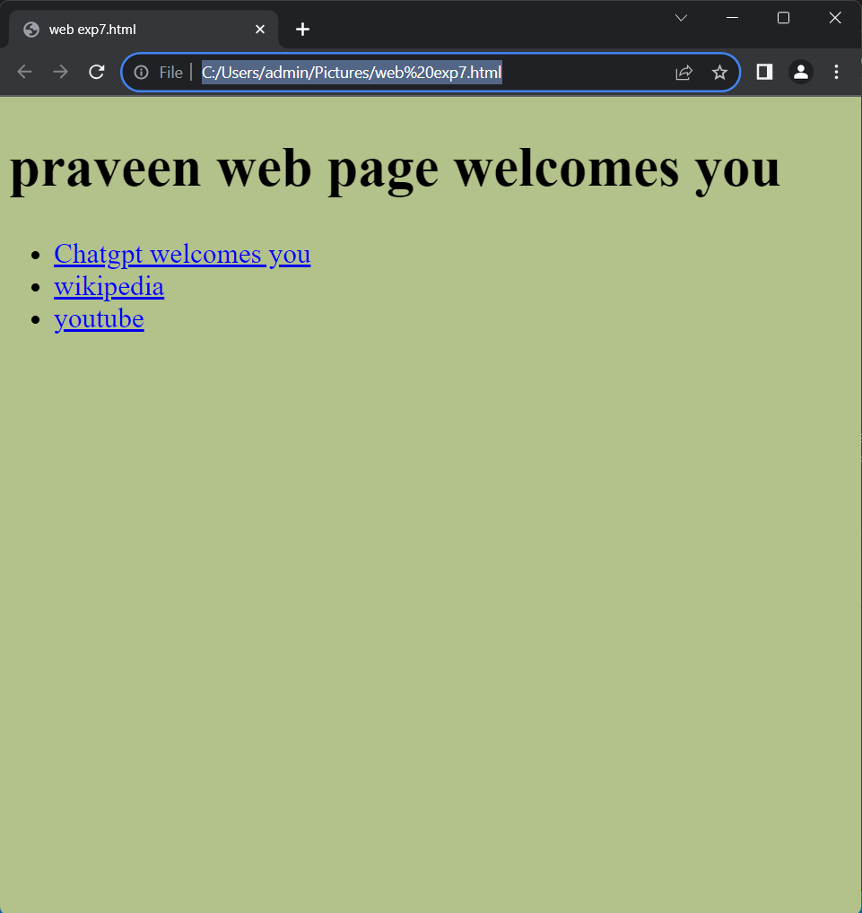
## (ii)Portrait mode
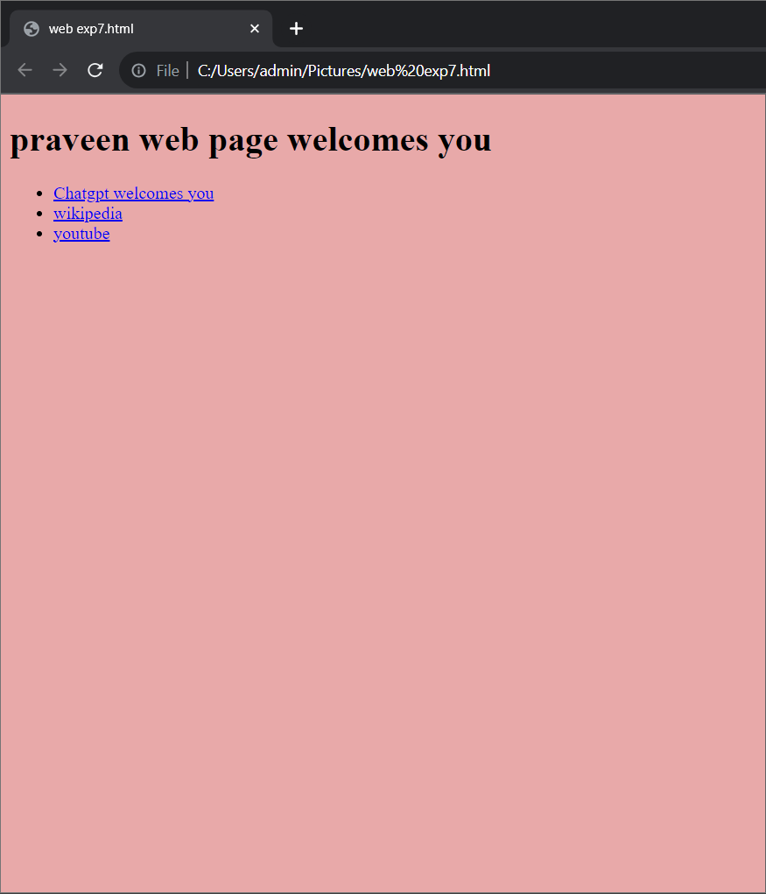

# Ex-07(iv)-css responsive typography
# AIM:
To use media queries to adjust typography (like font size and line spacing) on a website to improve readability across different device sizes, from mobile phones to large desktop monitors. Include a CSS code snippet in your explanation.

# DESIGN PROCEDURE:
## STEP 1:
Identify the HTML elements you want to style. In your case, it’s the h1 and li elements.

## STEP 2:
Define the base styles for these elements. This will be the default styling that applies when no media queries match.

## STEP 3:
Use media queries to apply different styles for different device sizes. The @media rule is used in CSS to apply styles for specific media types/devices.

## STEP 4:
Inside the media queries, specify the device size for which the styles should apply. You can use min-width and max-width properties to target devices with widths within a certain range.

## STEP 5:
Adjust Typography: Inside each media query block, adjust the typography (like font size and line spacing) for the identified elements.

## STEP 6:
Test your styles.

# CODE:
```
<!DOCTYPE html>
<html>
<head>
<style type="text/css">
    div, li {
        font-size: 16px;
        line-height: 1.5;
    }

    @media screen and (min-width: 600px) {
        div, li {
            font-size: 18px;
            line-height: 1.6;
        }
    }

    @media screen and (min-width: 900px) {
        div, li {
            font-size: 20px;
            line-height: 1.7;
        }
    }

    @media screen and (min-width: 1200px) {
        div, li {
            font-size: 22px;
            line-height: 1.8;
        }
    }
</style>
</head>
<body>
    <div>
    Saveetha Engineering College
  </div>
  <h1>praveen web page welcomes you</h1>
  <ul>
      <li><a href=https://chat.openai.com>Chatgpt welcomes you</a></li>
      <li><a href=https://www.wikipedia.org>wikipedia</a></li>
      <li><a href=https://www.youtube.com>youtube</a></li>
  </ul>
</div>
 </body>
</html>
```
# OUTPUT:
## (i)600px

## (ii)900px
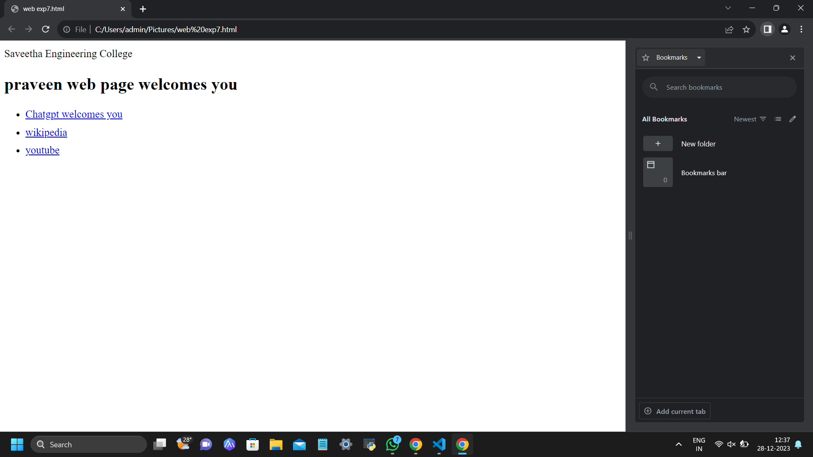
## (iii)1200px
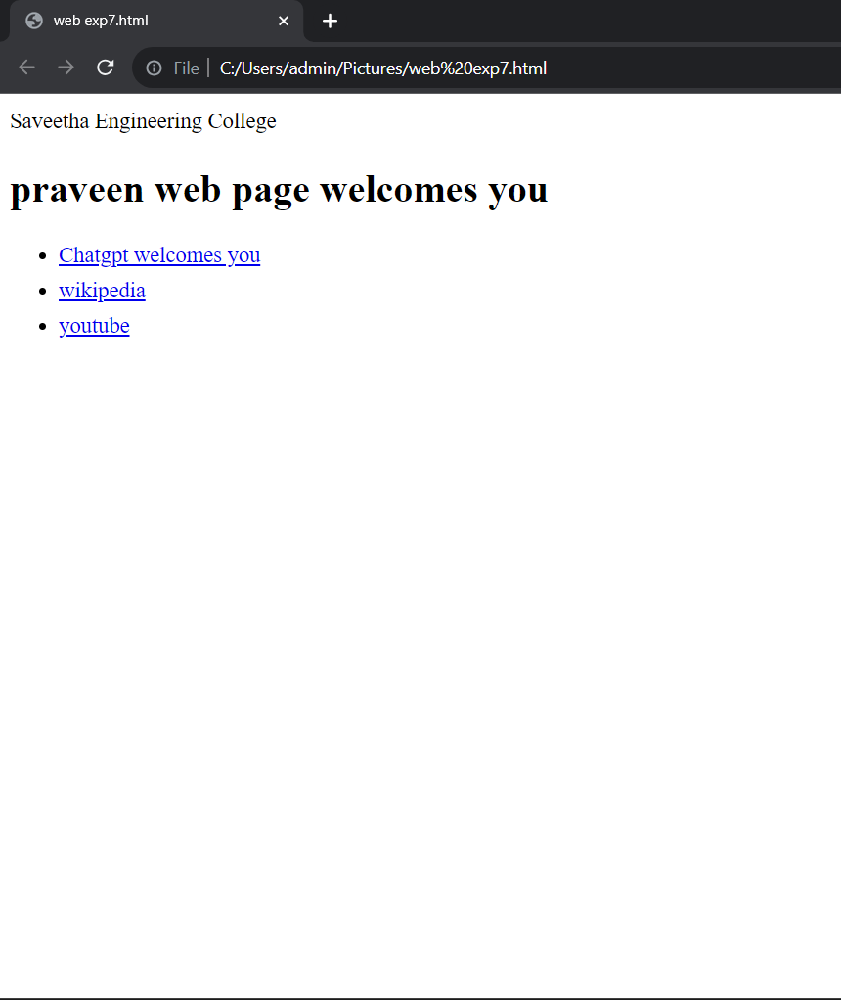
# Ex-07(v)-print-friendly css
# AIM:
To use a media query to change the styling of a webpage when it is printed, such as changing the background to white and hiding non-essential elements. Provide a CSS example.

# DESIGN PROCEDURE:
## STEP 1:
Identify the HTML elements you want to style. In your case, it’s the h1 and li elements.

## Step 2:
Define the base styles for these elements. This will be the default styling that applies when no media queries match.

## Step 3:
Use media queries to apply different styles for different media types. The @media rule is used in CSS to apply styles for specific media types/devices.

## Step 4:
Inside the media queries, specify the media type for which the styles should apply. You can use print to target printers.

## Step 5:
Adjust Styles: Inside each media query block, adjust the styles for the identified elements. You can change the background to white and hide non-essential elements.

## Step 6:
Test your styles using the print preview feature in browsers to ensure they work as expected.

## Step 7:
Iterate: Adjust your media queries and styles as needed based on your tests.

# CODE:
```
<!DOCTYPE html>
<html>
<head>
<style type="text/css">
    div, li {
        font-size: 16px;
        line-height: 1.5;
    }

    @media screen and (min-width: 600px) {
        div, li {
            font-size: 18px;
            line-height: 1.6;
        }
    }

    @media screen and (min-width: 900px) {
        div, li {
            font-size: 20px;
            line-height: 1.7;
        }
    }

    @media screen and (min-width: 1200px) {
        div, li {
            font-size: 22px;
            line-height: 1.8;
        }
    }
</style>
</head>
<body>
    <div>
    Saveetha Engineering College
  </div>
  <h1>praveen web page welcomes you</h1>
  <ul>
      <li><a href=https://chat.openai.com>Chatgpt welcomes you</a></li>
      <li><a href=https://www.wikipedia.org>wikipedia</a></li>
      <li><a href=https://www.youtube.com>youtube</a></li>
  </ul>
</div>
 </body>
</html>
```

#OUTPUT:
## (i)Default page
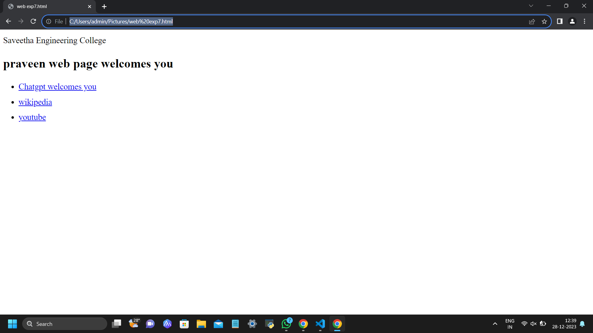
## (ii)Display none
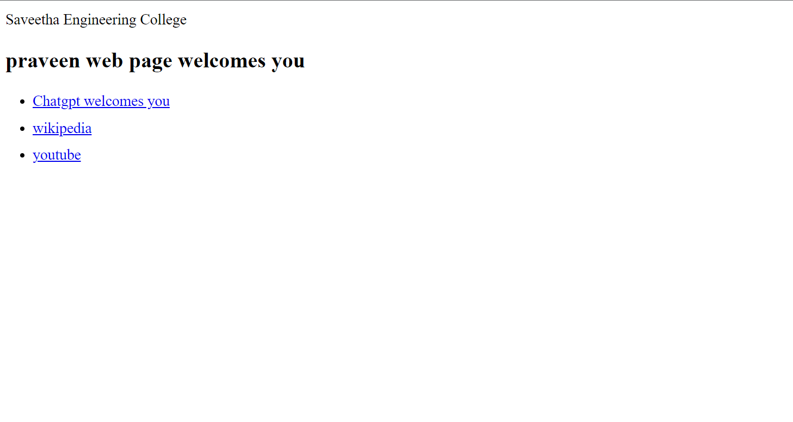

# Ex-07(vi)-Dark mode implementation
# AIM:
With the increasing popularity of dark mode in user interfaces, explain how you would use a media query to detect if the user has set their system to prefer a dark color scheme. Provide an example of how you would change the background and text colors of a website based on this preference.

# DESIGN PROCEDURE:
## Step 1:
Use the prefers-color-scheme media feature, which is used to detect if the user has requested the system use a light or dark color theme.

## Step 2:
The prefers-color-scheme media feature can have the values light, dark, or no-preference.

## Step 3:
In your CSS, you can use this feature within a @media rule to apply different styles depending on the user’s preference.

## Step 4:
You can set the background color to black and the text color to white when the user prefers a dark color scheme.

## Step 5:
Conversely, you can set the background color to white and the text color to black when the user prefers a light color scheme.

## Step 6:
If the user has no preference, you can choose a default color scheme.

## Step 7:
Remember to test your website in both light and dark modes to ensure the colors work well in both settings.

# CODE:
```
<!DOCTYPE html>
<html>
<head>
<style type="text/css">
    body {
        background-color: white;
        color: black;
    }
    @media (prefers-color-scheme: dark) {
        body {
            background-color: black;
            color: white;
        }
    }
    @media (prefers-color-scheme: light) {
        body {
            background-color: white;
            color: black;
        }
    }
</style>
</head>
<body>
    <div>
        <h1>praveen web page welcomes you</h1>
        <ul>
            <li><a href=https://chat.openai.com>Chatgpt welcomes you</a></li>
            <li><a href=https://www.wikipedia.org>wikipedia</a></li>
            <li><a href=https://www.youtube.com>youtube</a></li>
        </ul>
    </div>
 </body>
</html>
```
# OUTPUT:
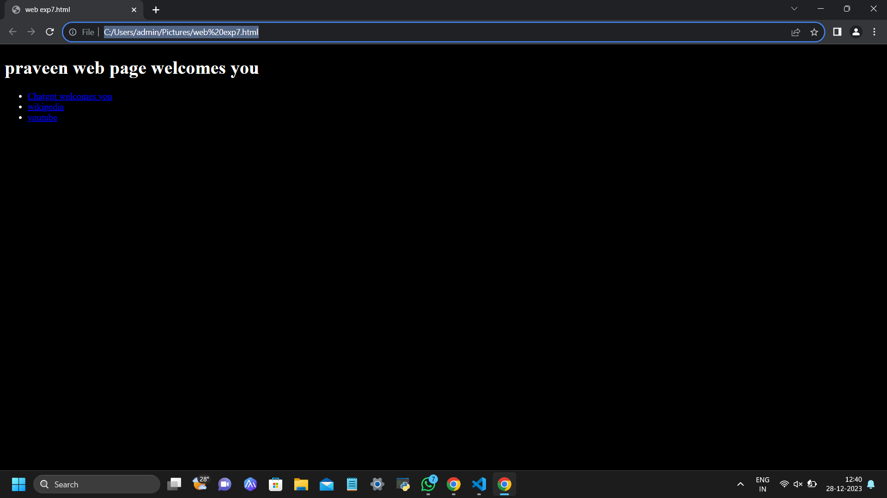

# RESULT:
Thus the output got successfully.